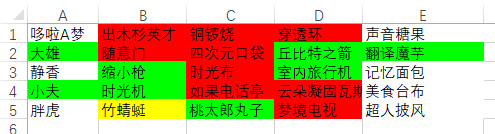
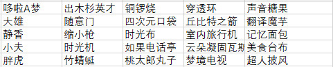

# GuessWord
25格猜词游戏

## 规则：

* 人数：至少4人，最多不限。

* 队别：分为两队，可简单理解为红绿两队。

* 红队队长 vs 绿队队长，其余人选队成为该队队长的队员。

* 表格：25个表格中填入25个词，红队队长和绿队队长能看到染上色后的表格图，而队员则只能看到空白色的表格图。

* 示例：

  染色后的表格

​	公开给队员看的表格

​	

* 回合制：

  红方先手，绿方后手，每队一人一个回合轮流进行猜词。

* 胜负：

  红方回合猜全9个词则胜，绿方回合猜全8个词为胜。

  任意一方在任意回合猜中黄色的地雷词为负。

  <未完，待补>